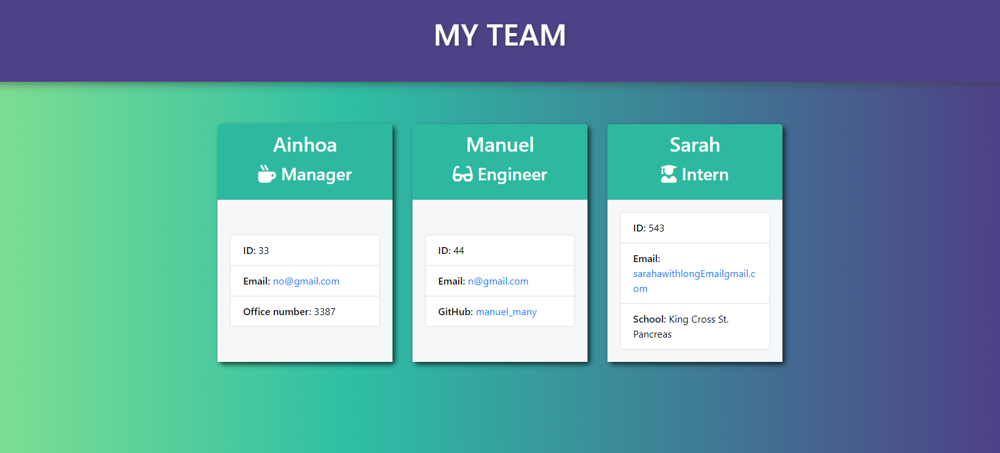
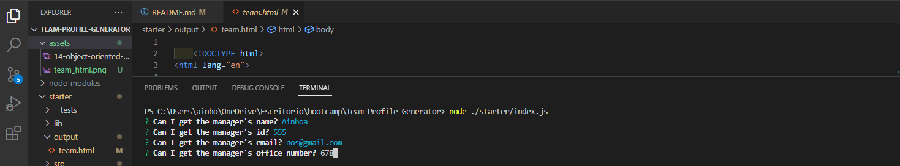

# Team Builder CLI Application

## Description
The Team Builder CLI Application is a Node.js command-line interface (CLI) application that allows users to build a team of workers and generate an HTML page displaying the team's information. The motivation behind creating this application is to provide a convenient way for managers to keep track of their team members' information in one place.
Through building this project, the developer has learned how to create a command-line interface application using Node.js, how to write modular and maintainable code, and how to work with external dependencies and libraries.

:point_right:  https://github.com/nowinoa/Team-Profile-Generator  :point_left:

## Table of Contents
* [Tools](#tools)
* [Installation](#installation)
* [Usage](#usage)
* [Credits](#credits)
* [License](#license)
* [Tests](#tests)
* [Questions](#questions)

## Tools
              

## Installation
To install the Team Builder CLI Application, follow the steps below:

1. Download the code from the GitHub repository.
2. Open a terminal or command prompt window and navigate to the project directory.
3. Run npm install to install the project dependencies.
4. Run npm init to initialize the project.
5. Run ./starter/index.js to start the application.
6. Follow the prompts to enter team member information and generate the HTML page.

## Usage
To use the Team Builder CLI Application, follow the steps below:

1. Open a terminal or command prompt window and navigate to the project directory.
2. Run ./starter/index.js to start the application.
3. Follow the prompts to enter team member information. The application will ask for the team manager's details first, and then prompt the user to add an engineer or intern.
4. Once all team members have been added, the application will generate an HTML page displaying the team's information.
5. Open the HTML file in a web browser to view the team's information.

## Credits
Created by <a href="https://github.com/nowinoa">Ainhoa Prada</a> who drew upon code from Dan Mueller and Stack Overflow as reference materials.

## License
This project is under MIT license.

## Tests
The Team Builder CLI Application uses Jest as a testing framework. To run the tests, follow the steps below:

1. Open a terminal or command prompt window and navigate to the project directory.
2. Run npm run test to run all the tests. Alternatively, run npm run test filename to run a specific test file.
3. Jest will execute the tests and output the results to the console.

## More Projects
To explore more about my projects visit my profile :point_right: <a href="https://github.com/nowinoa">:computer:</a>

© 2023 Ainhoa Prada. Confidential and Proprietary. All Rights Reserved.
